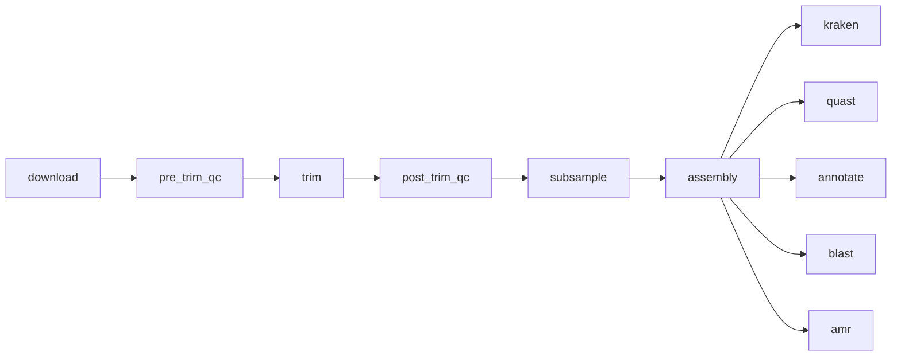

# Mystery Microbe

[](https://snakemake.readthedocs.io)
[](https://docs.conda.io)
[](https://www.illumina.com)
[](https://github.com/ablab/spades)
[](https://github.com/DerrickWood/kraken2)
[](https://github.com/ablab/quast)
[](https://github.com/tseemann/prokka)
[](https://blast.ncbi.nlm.nih.gov)
[](https://github.com/tseemann/abricate)

Identify an unknown bacterial isolate from raw Illumina reads using a Snakemake
pipeline: download → QC → trim → subsample → assemble → identify.

## Dataset
- **Accession**: SRR2584863
- **Platform**: Illumina HiSeq 2500 2×150 bp
- **Total read pairs**: 1,553,259 (per mate)
- **Coverage**: 100.4x (total sequenced base pairs / E. coli genome length of 4.64 Mb)

## Pipeline



1. **Download** (`download`) — sra-tools → `data/raw/{sample}_{1,2}.fastq.gz`
2. **Pre-trim QC** (`pre_trim_qc`, `pre_trim_multi_qc`) — fastqc, multiqc → `results/01_qc/pre_trim/`
3. **Trim** (`trim`) — fastp → `results/02_trimmed/`
4. **Post-trim QC** (`post_trim_qc`, `post_trim_multi_qc`) — fastqc, multiqc → `results/01_qc/post_trim/`
5. **Subsample** (`subsample`) — seqkit → `results/03_subsampled/`
6. **Assembly** (`assembly`) — spades → `results/04_assembly/{sample}_assembled.fasta`
7. **Kraken** (`kraken_download`, `kraken_run`) — kraken2 → `results/04_assembly/{sample}_report.txt`
8. **QUAST** (`quast`) — quast → `results/04_assembly/quast/{sample}/report.tsv`
9. **Annotate** (`annotate`) — prokka → `results/06_annotation/{sample}.gff`
10. **BLAST** (`barrnap`, `extract_16s`, `download_16s_db`, `blastn_16s`) — barrnap, bedtools, blast → `results/05_blast/{sample}_16S_blastn.tsv`
11. **AMR** (`amr`) — abricate → `results/07_amr/{sample}_amr_results.tsv`

## Requirements
- [Snakemake](https://snakemake.readthedocs.io/) (with conda support)
- [Conda](https://docs.conda.io/) / Mamba
- Reference files in `reference/`:
  - `GCA_000005845.2.fasta` (QUAST reference genome)
  - `blast_db/16S_ribosomal_RNA` (downloaded by the `download_16s_db` rule)
  - `kraken2_db/` (downloaded by the `kraken_download` rule)

Each rule declares its own conda environment under `envs/`, so no manual tool
installation is required.

## Usage

```bash
# Preview the workflow
snakemake -n

# Run (create/activate conda envs per rule)
snakemake --use-conda --cores 4

# Force a full re-run
snakemake --use-conda --cores 4 -F
```

Edit `config/config.yaml` to add samples or change directories/parameters.
Logs are written to `logs/` and results to `results/`.

## QC Summary
- **Reads after trimming**: 1,199,367
- **% reads passing QC**: 77.2%
- **Mean quality score**:
  - Before trimming: Q20 89.17%, Q30 81.63%
  - After trimming: Q20 96.32%, Q30 89.18%
- **GC content**: 50.64%

## Assembly Summary
- **# contigs**: 286 (≥ 0 bp); 72 contigs ≥ 500 bp
- **Total length**: 4,571,933 bp (4,542,339 bp in contigs ≥ 500 bp)
- **N50**: 131,916 bp
- **Reference**: GCA_000005845.2

## Species Identification
- **Top BLAST hit**: Escherichia fergusonii
- **Average % identity**: 99.55% (across all hits)
- **Number of reads matching**: 4 unique assembled contigs (resulting in 20 total BLAST alignments) 
- **Confidence**: Medium

## Annotation

```
contigs: 286
bases: 4571933
CDS: 4244
rRNA: 7
repeat_region: 2
tRNA: 54
tmRNA: 1
```
### Notable genes

```
awk -F'\t' '
BEGIN { print "| Locus Tag | Gene | Product |\n| --- | --- | --- |" }
NR>1 && tolower($7) ~ /resistance|beta-lactamase|efflux/ { 
    print "| " $1 " | " ($4 == "" ? "N/A" : $4) " | " $7 " |" 
}' results/06_annotation/SRR2584863.tsv
```

| Locus Tag | Gene | Product |
| --- | --- | --- |
| MBPGHIIC_00137 | mdtK | Multidrug resistance protein MdtK |
| MBPGHIIC_00156 | aaeB_1 | p-hydroxybenzoic acid efflux pump subunit AaeB |
| MBPGHIIC_00157 | aaeA_1 | p-hydroxybenzoic acid efflux pump subunit AaeA |
| MBPGHIIC_00277 | kefF | Glutathione-regulated potassium-efflux system ancillary protein KefF |
| MBPGHIIC_00278 | kefC_1 | Glutathione-regulated potassium-efflux system protein KefC |
| MBPGHIIC_00300 | setA | Sugar efflux transporter A |
| MBPGHIIC_00569 | ampC | Beta-lactamase |
| MBPGHIIC_00670 | acrB_1 | multidrug efflux RND transporter permease subunit AcrB |
| MBPGHIIC_00784 | eamB | Cysteine/O-acetylserine efflux protein |
| MBPGHIIC_00868 | kefC_2 | Glutathione-regulated potassium-efflux system protein KefC |
| MBPGHIIC_01013 | acrZ | Multidrug efflux pump accessory protein AcrZ |
| MBPGHIIC_01068 | bhsA_1 | Multiple stress resistance protein BhsA |
| MBPGHIIC_01185 | leuE | Leucine efflux protein |
| MBPGHIIC_01208 | mntP | putative manganese efflux pump MntP |
| MBPGHIIC_01581 | bhsA_2 | Multiple stress resistance protein BhsA |
| MBPGHIIC_01627 | mdtH | Multidrug resistance protein MdtH |
| MBPGHIIC_01851 | mdtL | Multidrug resistance protein MdtL |
| MBPGHIIC_01886 | emrD | Multidrug resistance protein D |
| MBPGHIIC_01898 | nepI | Purine ribonucleoside efflux pump NepI |
| MBPGHIIC_01902 | setC | Sugar efflux transporter C |
| MBPGHIIC_02297 | emrY | putative multidrug resistance protein EmrY |
| MBPGHIIC_02298 | emrK | putative multidrug resistance protein EmrK |
| MBPGHIIC_02329 | rhtC_1 | Threonine efflux protein |
| MBPGHIIC_02368 | iprA | Inhibitor of hydrogen peroxide resistance |
| MBPGHIIC_02462 | srpC | Solvent efflux pump outer membrane protein SrpC |
| MBPGHIIC_02493 | setB | Sugar efflux transporter B |
| MBPGHIIC_02506 | bcr | Bicyclomycin resistance protein |
| MBPGHIIC_02696 | rhtC_2 | Threonine efflux protein |
| MBPGHIIC_02697 | rhtB | Homoserine/homoserine lactone efflux protein |
| MBPGHIIC_02776 | mdtM | Multidrug resistance protein MdtM |
| MBPGHIIC_02838 | eamA | putative amino-acid metabolite efflux pump |
| MBPGHIIC_02840 | marA | Multiple antibiotic resistance protein MarA |
| MBPGHIIC_02841 | marR | Multiple antibiotic resistance protein MarR |
| MBPGHIIC_02845 | sotB | Sugar efflux transporter |
| MBPGHIIC_02981 | fieF | Cation-efflux pump FieF |
| MBPGHIIC_03015 | acrF | multidrug efflux RND transporter permease subunit AcrF |
| MBPGHIIC_03038 | aaeA_2 | p-hydroxybenzoic acid efflux pump subunit AaeA |
| MBPGHIIC_03039 | aaeB_2 | p-hydroxybenzoic acid efflux pump subunit AaeB |
| MBPGHIIC_03266 | acrB_2 | multidrug efflux RND transporter permease subunit AcrB |
| MBPGHIIC_03267 | mdtE | Multidrug resistance protein MdtE |
| MBPGHIIC_03303 | hcpA | Beta-lactamase HcpA |
| MBPGHIIC_03414 | arnA | Bifunctional polymyxin resistance protein ArnA |
| MBPGHIIC_03438 | fsr | Fosmidomycin resistance protein |
| MBPGHIIC_03455 | acrA | Multidrug efflux pump subunit AcrA |
| MBPGHIIC_03456 | acrB_3 | multidrug efflux RND transporter permease subunit AcrB |
| MBPGHIIC_03468 | smdB | multidrug efflux ABC transporter permease/ATP-binding subunit SmdB |
| MBPGHIIC_03469 | smdA | multidrug efflux ABC transporter permease/ATP-binding subunit SmdA |
| MBPGHIIC_03896 | tehA | Tellurite resistance protein TehA |
| MBPGHIIC_04016 | mdtD | Putative multidrug resistance protein MdtD |
| MBPGHIIC_04017 | mdtC | Multidrug resistance protein MdtC |
| MBPGHIIC_04018 | mdtB | Multidrug resistance protein MdtB |
| MBPGHIIC_04019 | mdtA | Multidrug resistance protein MdtA |
| MBPGHIIC_04040 | cusC_1 | Cation efflux system protein CusC |
| MBPGHIIC_04041 | cusF | Cation efflux system protein CusF |
| MBPGHIIC_04042 | cusB | Cation efflux system protein CusB |
| MBPGHIIC_04043 | silA | Cu(+)/Ag(+) efflux RND transporter permease subunit SilA |
| MBPGHIIC_04085 | yaaA | DNA-binding and peroxide stress resistance protein YaaA |
| MBPGHIIC_04131 | mdtN | Multidrug resistance protein MdtN |
| MBPGHIIC_04132 | mdtO | Multidrug resistance protein MdtO |
| MBPGHIIC_04133 | cusC_2 | Cation efflux system protein CusC |
| MBPGHIIC_04217 | corC | Magnesium and cobalt efflux protein CorC |


## Antimicrobial Resistance (AMR)

```
awk -F'\t' '
BEGIN { print "| Gene | % Identity | Resistance Profile | Product |\n| --- | --- | --- | --- |" }
NR>1 { 
    print "| " $6 " | " $11 " | " $15 " | " $14 " |" 
}' results/07_amr/SRR2584863_amr_results.tsv
```

| Gene | % Identity | Resistance Profile | Product |
| --- | --- | --- | --- |
| H-NS | 99.52 | cephalosporin;fluoroquinolone;macrolide;penicillin_beta-lactam;tetracycline | H-NS is a histone-like protein involved in global gene regulation in Gram-negative bacteria. It is a repressor of the membrane fusion protein genes acrE mdtE and emrK as well as nearby genes of many RND-type multidrug exporters. |
| bacA | 99.27 | peptide | The bacA gene product (BacA) recycles undecaprenyl pyrophosphate during cell wall biosynthesis which confers resistance to bacitracin. |
| TolC | 99.93 | aminocoumarin;aminoglycoside;carbapenem;cephalosporin;disinfecting_agents_and_antiseptics;fluoroquinolone;glycylcycline;macrolide;penicillin_beta-lactam;peptide;phenicol;rifamycin;tetracycline | TolC is a protein subunit of many multidrug efflux complexes in Gram negative bacteria. It is an outer membrane efflux protein and is constitutively open. Regulation of efflux activity is often at its periplasmic entrance by other components of the efflux complex. |
| emrY | 99.03 | tetracycline | emrY is a multidrug transport that moves substrates across the inner membrane of the Gram-negative E. coli. It is a homolog of emrB. |
| emrK | 99.81 | tetracycline | emrK is a membrane fusion protein that is a homolog of EmrA. Together with the inner membrane transporter EmrY and the outer membrane channel TolC it mediates multidrug efflux. |
| evgA | 100.00 | fluoroquinolone;macrolide;penicillin_beta-lactam;tetracycline | EvgA when phosphorylated is a positive regulator for efflux protein complexes emrKY and mdtEF. While usually phosphorylated in a EvgS dependent manner it can be phosphorylated in the absence of EvgS when overexpressed. |
| evgS | 99.97 | fluoroquinolone;macrolide;penicillin_beta-lactam;tetracycline | EvgS is a sensor protein that phosphorylates the regulatory protein EvgA. evgS corresponds to 1 locus in Pseudomonas aeruginosa PAO1 and 1 locus in Pseudomonas aeruginosa LESB58. |
| mdtM | 100.00 | disinfecting_agents_and_antiseptics;fluoroquinolone;lincosamide;nucleoside;phenicol | Multidrug resistance protein MdtM. |
| marA | 100.00 | carbapenem;cephalosporin;disinfecting_agents_and_antiseptics;fluoroquinolone;glycylcycline;monobactam;penicillin_beta-lactam;phenicol;rifamycin;tetracycline | In the presence of antibiotic stress E. coli overexpresses the global activator protein MarA which besides inducing MDR efflux pump AcrAB also down- regulates synthesis of the porin OmpF. |
| cpxA | 98.91 | aminocoumarin;aminoglycoside | CpxA is a membrane-localized sensor kinase that is activated by envelope stress. It starts a kinase cascade that activates CpxR which promotes efflux complex expression. |
| AcrF | 98.97 | cephalosporin;fluoroquinolone;penicillin_beta-lactam | AcrF is a inner membrane transporter similar to AcrB. |
| AcrE | 98.88 | cephalosporin;fluoroquinolone;penicillin_beta-lactam | AcrE is a membrane fusion protein similar to AcrA. |
| AcrS | 99.09 | cephalosporin;disinfecting_agents_and_antiseptics;fluoroquinolone;glycylcycline;penicillin_beta-lactam;phenicol;rifamycin;tetracycline | AcrS is a repressor of the AcrAB efflux complex and is associated with the expression of AcrEF. AcrS is believed to regulate a switch between AcrAB and AcrEF efflux. |
| gadX | 100.00 | fluoroquinolone;macrolide;penicillin_beta-lactam | GadX is an AraC-family regulator that promotes mdtEF expression to confer multidrug resistance. |
| gadW | 94.65 | fluoroquinolone;macrolide;penicillin_beta-lactam | GadW is an AraC-family regulator that promotes mdtEF expression to confer multidrug resistance. GadW inhibits GadX-dependent activation. GadW clearly represses gadX and in situations where GadX is missing activates gadA and gadBC. |
| mdtF | 99.97 | fluoroquinolone;macrolide;penicillin_beta-lactam | MdtF is the multidrug inner membrane transporter for the MdtEF-TolC efflux complex. |
| mdtE | 100.00 | fluoroquinolone;macrolide;penicillin_beta-lactam | MdtE is the membrane fusion protein of the MdtEF multidrug efflux complex. It shares 70% sequence similarity with AcrA. |
| YojI | 99.09 | peptide | YojI mediates resistance to the peptide antibiotic microcin J25 when it is expressed from a multicopy vector. YojI is capable of pumping out microcin molecules.  The outer membrane protein TolC in addition to YojI is required for export of microcin J25 out of the cell. Microcin J25 is thus the first known substrate for YojI. |
| PmrF | 100.00 | peptide | PmrF is required for the synthesis and transfer of 4-amino-4-deoxy-L-arabinose (Ara4N) to Lipid A which allows gram-negative bacteria to resist the antimicrobial activity of cationic antimicrobial peptides and antibiotics such as polymyxin. pmrF corresponds to 1 locus in Pseudomonas aeruginosa PAO1 and 1 locus in Pseudomonas aeruginosa LESB58. |
| Escherichia_coli_acrA | 100.00 | cephalosporin;disinfecting_agents_and_antiseptics;fluoroquinolone;glycylcycline;penicillin_beta-lactam;phenicol;rifamycin;tetracycline | AcrA is a subunit of the AcrAB-TolC multidrug efflux system found in E. coli. |
| acrB | 99.94 | cephalosporin;disinfecting_agents_and_antiseptics;fluoroquinolone;glycylcycline;penicillin_beta-lactam;phenicol;rifamycin;tetracycline | Protein subunit of AcrA-AcrB-TolC multidrug efflux complex. AcrB functions as a herterotrimer which forms the inner membrane component and is primarily responsible for substrate recognition and energy transduction by acting as a drug/proton antiporter. |
| emrB | 99.94 | fluoroquinolone | emrB is a translocase in the emrB -TolC efflux protein in E. coli. It recognizes substrates including carbonyl cyanide m-chlorophenylhydrazone (CCCP) nalidixic acid and thioloactomycin. |
| emrA | 99.83 | fluoroquinolone | EmrA is a membrane fusion protein providing an efflux pathway with EmrB and TolC between the inner and outer membranes of E. coli a Gram-negative bacterium. |
| emrR | 100.00 | fluoroquinolone | EmrR is a negative regulator for the EmrAB-TolC multidrug efflux pump in E. coli. Mutations lead to EmrAB-TolC overexpression. |
| leuO | 98.09 | disinfecting_agents_and_antiseptics;nucleoside | leuO a LysR family transcription factor exists in a wide variety of bacteria of the family Enterobacteriaceae and is involved in the regulation of as yet unidentified genes affecting the stress response and pathogenesis expression. LeuO is also an activator of the MdtNOP efflux pump. |
| Escherichia_coli_emrE | 99.10 | macrolide | Member of the small MDR (multidrug resistance) family of transporters; in Escherichia coli this protein provides resistance against a number of positively charged compounds including ethidium bromide and erythromycin; proton-dependent secondary transporter which exchanges protons for compound translocation. |
| EC-15 | 98.59 | cephalosporin | EC-15 is a EC beta-lactamase. |
| eptA | 99.45 | peptide | PmrC mediates the modification of Lipid A by the addition of 4-amino-4-deoxy-L-arabinose (L-Ara4N) and phosphoethanolamine resulting in a less negative cell membrane and decreased binding of polymyxin B. |
| mdtC | 99.87 | aminocoumarin | MdtC is a transporter that forms a heteromultimer complex with MdtB to form a multidrug transporter. MdtBC is part of the MdtABC-TolC efflux complex. In the absence of MdtB MdtC can form a homomultimer complex that results in a functioning efflux complex with a narrower drug specificity. mdtC corresponds to 3 loci in Pseudomonas aeruginosa PAO1 (gene name: muxC/muxB) and 3 loci in Pseudomonas aeruginosa LESB58. |
| mdtB | 98.27 | aminocoumarin | MdtB is a transporter that forms a heteromultimer complex with MdtC to form a multidrug transporter. MdtBC is part of the MdtABC-TolC efflux complex. |
| mdtA | 97.60 | aminocoumarin | MdtA is the membrane fusion protein of the multidrug efflux complex mdtABC. |
| kdpE | 99.85 | aminoglycoside | kdpE is a transcriptional activator that is part of the two-component system KdpD/KdpE that is studied for its regulatory role in potassium transport and has been identified as an adaptive regulator involved in the virulence and intracellular survival of pathogenic bacteria. kdpE regulates a range of virulence loci through direct promoter binding. |
| mdtN | 99.90 | disinfecting_agents_and_antiseptics;nucleoside | Multidrug resistance efflux pump. Could be involved in resistance to puromycin acriflavine and tetraphenylarsonium chloride. |
| mdtO | 99.85 | disinfecting_agents_and_antiseptics;nucleoside | Multidrug resistance efflux pump. Could be involved in resistance to puromycin acriflavine and tetraphenylarsonium chloride. |
| mdtP | 100.00 | disinfecting_agents_and_antiseptics;nucleoside | Multidrug resistance efflux pump. Could be involved in resistance to puromycin acriflavine and tetraphenylarsonium chloride. |
| acrD | 99.78 | aminoglycoside | AcrD is an aminoglycoside efflux pump expressed in E. coli. Its expression can be induced by indole and is regulated by baeRS and cpxAR. |
| CRP | 99.84 | fluoroquinolone;macrolide;penicillin_beta-lactam | CRP is a global regulator that represses MdtEF multidrug efflux pump expression. |
| Escherichia_coli_mdfA | 98.38 | disinfecting_agents_and_antiseptics;phenicol;tetracycline | Multidrug efflux pump in E. coli. This multidrug efflux system was originally identified as the Cmr/CmlA chloramphenicol exporter. |
| ugd | 98.37 | peptide | PmrE is required for the synthesis and transfer of 4-amino-4-deoxy-L-arabinose (Ara4N) to Lipid A which allows gram-negative bacteria to resist the antimicrobial activity of cationic antimicrobial peptides and antibiotics such as polymyxin. |
| OmpA | 83.66 | peptide | OmpA is a porin that confers resistance to beta-lactam antibiotics. |
| msbA | 100.00 | nitroimidazole | MsbA is a multidrug resistance transporter homolog from E. coli and belongs to a superfamily of transporters that contain an adenosine triphosphate (ATP) binding cassette (ABC) which is also called a nucleotide-binding domain (NBD). MsbA is a member of the MDR-ABC transporter group by sequence homology. MsbA transports lipid A a major component of the bacterial outer cell membrane and is the only bacterial ABC transporter that is essential for cell viability. |
| mdtH | 97.93 | fluoroquinolone | Multidrug resistance protein MdtH. |
| mdtG | 99.43 | phosphonic_acid | The MdtG protein also named YceE appears to be a member of the major facilitator superfamily of transporters and it has been reported when overexpressed to increase fosfomycin and deoxycholate resistances. mdtG is a member of the marA-soxS-rob regulon. |

## Conclusion
Based on BLAST analysis of the assembled 16S rRNA sequences against the NCBI 16S ribosomal RNA database, the isolate is identified as Escherichia fergusonii with medium confidence. As 16S RNA blast results are not reliable for closely related genuses (Escherichia and Shigella), other methods are recommended. Escherichia/Shigella group share over 99% 16S RNA sequence identity.

Kraken2 confirms that 67.83% of the reads belong to the Enterobacteriaceae family. 
26.57% of the reads overlap with Escherichia coli. 

**The mystery microbe most likely is Escherichia coli.**

## Tools and Versions
- sra-tools: 3.4.1
- fastqc: 0.12.1
- multiqc: 1.35
- fastp: 0.24.3
- seqkit: 2.13.0
- spades: 4.3.0
- kraken2: 2.17.1
- quast: 5.3.0
- prokka: 1.15.6
- barrnap: 1.10.6
- bedtools: 2.31.1
- blast: 2.17.0
- abricate: 1.4.0
